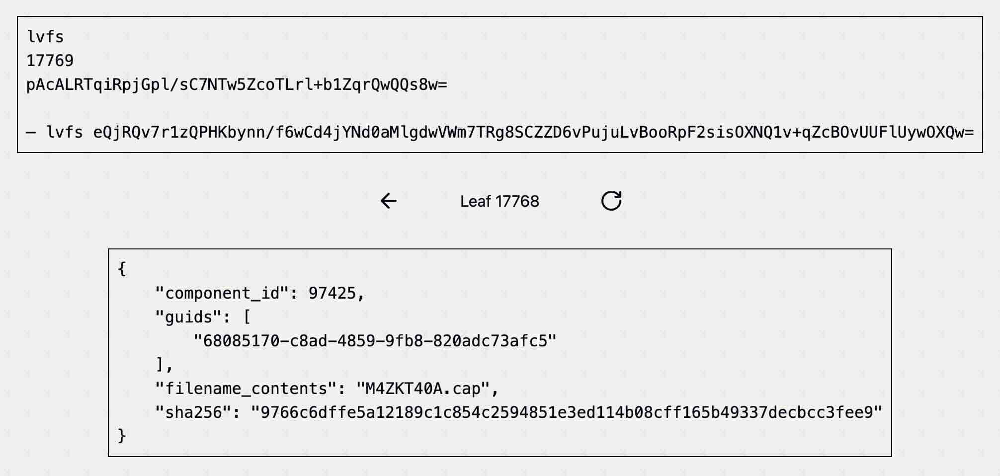

# Web Based Log Explorer

To preview this project locally with a few logs, run `npm run preview` after installing dependencies using `npm install`.

To build an `index.html` file for your serverless tile based log, fill in the .env file with your log configuration and run `npm run build`. Otherwise, it will default a predefined list of public logs with open CORS headers. This single file includes all the JS and is about 7kB gzipped.

If the `index.html` is located at a path on the same domain as the monitoring URL, then things will work properly. If the file is located on a seperate domain, the log needs to return proper CORS headers on its responses.

When running locally, all requests to the selected log are made through a local proxy server which adds a CORS header to the response.

### Preview

[Hosted UI](https://ui.itko.dev/) for Armored Witness Prod/Dev and Armory Drive Prod 2 logs. These logs are included because they return `access-control-allow-origin: *` on GET requests.

